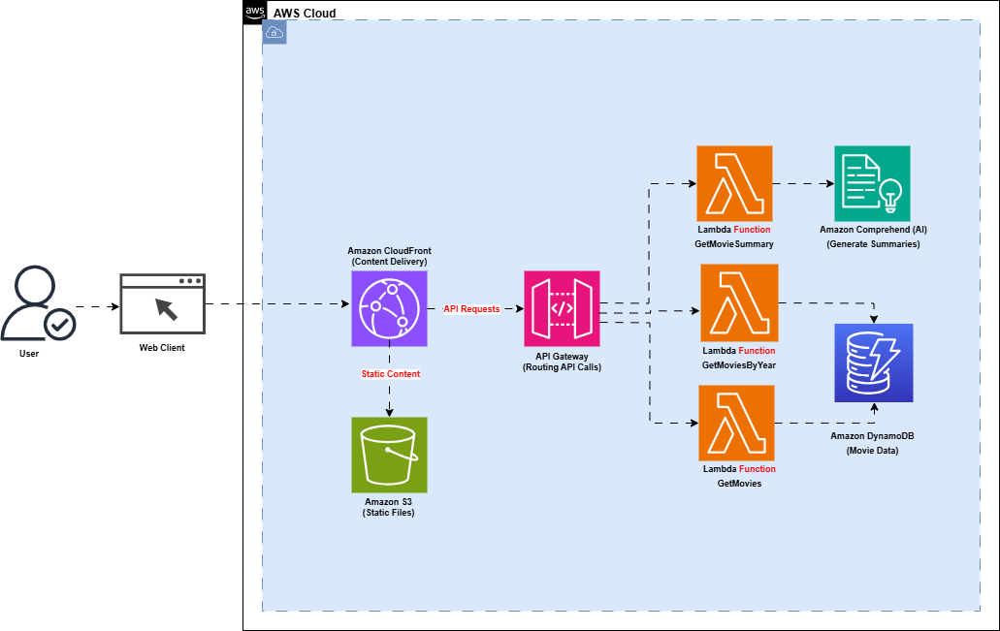

# **Serverless Movie API**

**Description**  
This project involves setting up a scalable and secure infrastructure for a serverless Movies API on AWS. It showcases my expertise in designing and implementing cloud-native solutions using Infrastructure-as-Code, serverless architecture, and monitoring tools.

---

## **Table of Contents**

1. [Overview](#overview)
2. [Architecture Diagram](#architecture-diagram)
3. [Skills and Technologies](#skills-and-technologies)
4. [Prerequisites](#prerequisites)
5. [Setup Instructions](#setup-instructions)
6. [Project Features](#project-features)
7. [Challenges and Solutions](#challenges-and-solutions)
8. [Outcomes and Key Learnings](#outcomes-and-key-learnings)
9. [Future Improvements](#future-improvements)
10. [References](#references)

---
## **Overview**

### **Project Goals**

The main objectives of the project are;
    - Build a serverless API to manage and retrieve movie data.
    - Use Infrastructure-as-Code to automate resource provisioning on AWS.
    - Ensure high availability and scalability using cloud-native services.

### **Key Highlights**

- Demonstrates skills in Terraform, AWS Lambda, DynamoDB, S3, and API Gateway.
- Includes automation scripts for CI/CD pipelines.
- Implements best practices for security and monitoring.

---

## **Architecture Diagram**

- **Components**:
    - API Gateway → Lambda Functions → DynamoDB
    - S3 Bucket for storage
    - CloudWatch for monitoring



---

## **Skills and Technologies**

Highlight the tools, technologies, and skills used in the project.

- **Cloud Provider**: AWS (DynamoDB, S3, Lambda, API Gateway, CloudWatch)
- **Infrastructure-as-Code**: Terraform / CloudFormation
- **Languages**: Python, YAML, HCL
- **CI/CD**: GitHub Actions, AWS CodePipeline
- **Monitoring**: AWS CloudWatch, CloudTrail

---
## **Prerequisites**

The tools and configurations required to set up and run the project locally or on the cloud are listed below.

- AWS account with administrative access
- Installed tools:
    - Terraform (v1.x) or AWS CLI (v2.x)
    - Python 3.9+
    - Git

---

## **Setup Instructions**

### **Step 1: Clone the Repository**

```bash
git clone https://github.com/your-username/project-repo.git
cd project-repo
```

### **Step 2: Configure AWS Credentials**

Set up AWS credentials for Terraform or AWS CLI:

```bash
aws configure
```
Enter the information for **AWS Access Key ID**, **AWS Secret Access Key**, **Default region name**, and **Default output format**

```bash
AWS Access Key ID : [****************MUG3B]
AWS Secret Access Key : [****************jKb9]
Default region name : [us-east-1]
Default output format : [json]
```

### **Step 3: Deploy Infrastructure**

#### **Using Terraform**:

**Note**: *Edit the resource for the S3 bucket name and make sure to update the name through the code*

```bash
terraform init
terraform apply
```


